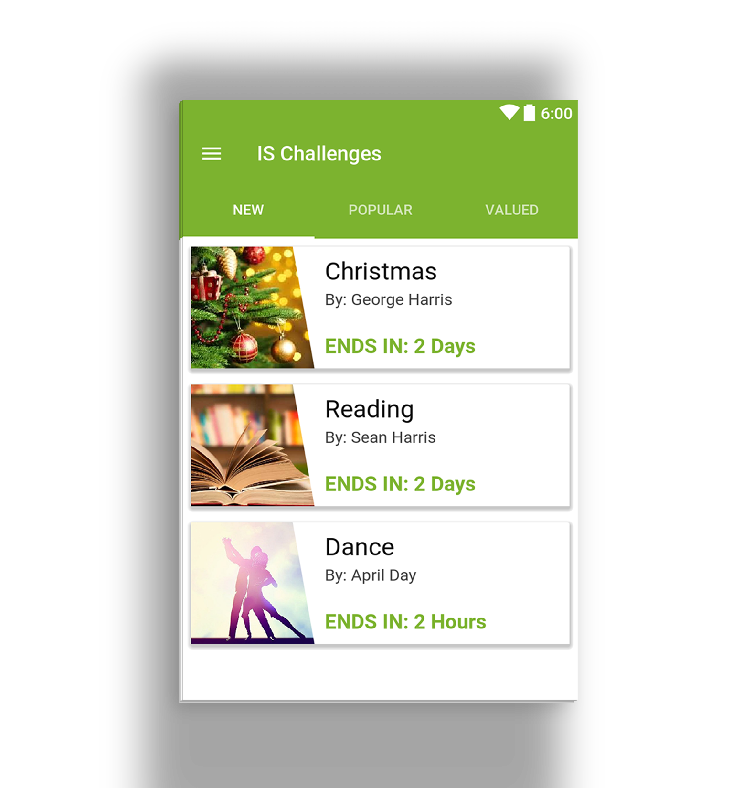

# Squint
Provide Diagonal cut on view with awesome customization #DiagonalView

[](http://android-arsenal.com/details/1/4458) [](https://android-arsenal.com/api?level=9) [](https://jitpack.io/#IntruderShanky/Squint)

<a href='https://ko-fi.com/A373L0C' target='_blank'></a> 

[Demo App - IS Library](https://play.google.com/store/apps/details?id=com.intrusoft.islibrarydemo)

<a href='https://play.google.com/store/apps/details?id=com.intrusoft.islibrarydemo&utm_source=global_co&utm_small=prtnr&utm_content=Mar2515&utm_campaign=PartBadge&pcampaignid=MKT-Other-global-all-co-prtnr-py-PartBadge-Mar2515-1'></a>

# Preview


* Provide Diagonal anywhere we want
* Provide Tint filter on image
* Provide Solid color shape
* Fully Customizable

# Usage
Step 1. Add the JitPack repository to your build file
```groovy
allprojects {
        repositories {
            ...
            maven { url "https://jitpack.io" }
        }
    }
```
Step 2. Add the dependency
```groovy
dependencies {
  compile 'com.github.IntruderShanky:Squint:3.0.1'
 }
 ```
 
 
 
# Implementation
###XML Implementation:
```xml
   <com.intrusoft.squint.DiagonalView
                android:id="@+id/diagonal"
                android:layout_width="match_parent"
                android:layout_height="240dp"
                android:scaleType="centerCrop"
                android:src="@drawable/c1"
                squint:diagonalDirection="bottom_to_top"
                squint:angle="12"
                squint:gravity="right" />
```
###Attributes
####Diagonal Angle
```xml
 squint:angle
```
####Diagonal Gravity
```xml
squint:gravity="left"
squint:gravity="right"
squint:gravity="top"
squint:gravity="bottom"
```
####Diagonal Direction
```xml
squint:diagonalDirection="left_to_right"
squint:diagonalDirection="top_to_bottom"
squint:diagonalDirection="right_to_left"
squint:diagonalDirection="bottom_to_top"
```
####Background Tint Color (Color Shold have some alpha value, default value 55)
```xml
squint:tint="@color/your_color"
```
####To make solid color Diagonal
```xml
squint:solidColor="@color/your_color"
```

###Java Implementation:
```java
DiagonalView diagonalView = (DiagonalView) findViewById(R.id.diagonal);

// to set image from resources        
diagonalView.setImageSource(R.drawable.your_image);

// to set bitmap
diagonalView.setBitmap(bitmap);

// to set the diagonal angle
diagonalView.setAngle(15);

// to set the diagonal gravity
diagonalView.setGravity(DiagonalView.Gravity.LEFT);

// to set the background color (color should have some alpha val)
diagonalView.setColorTint(Color.GREEN);

// to make the solid color diagonal
diagonalView.setSolidColor(Color.BLUE);
```
#Licence
```
Licensed under the Apache License, Version 2.0 (the "License");
you may not use this file except in compliance with the License.
You may obtain a copy of the License at

    http://www.apache.org/licenses/LICENSE-2.0

Unless required by applicable law or agreed to in writing, software
distributed under the License is distributed on an "AS IS" BASIS,
WITHOUT WARRANTIES OR CONDITIONS OF ANY KIND, either express or implied.
See the License for the specific language governing permissions and
limitations under the License.
```
